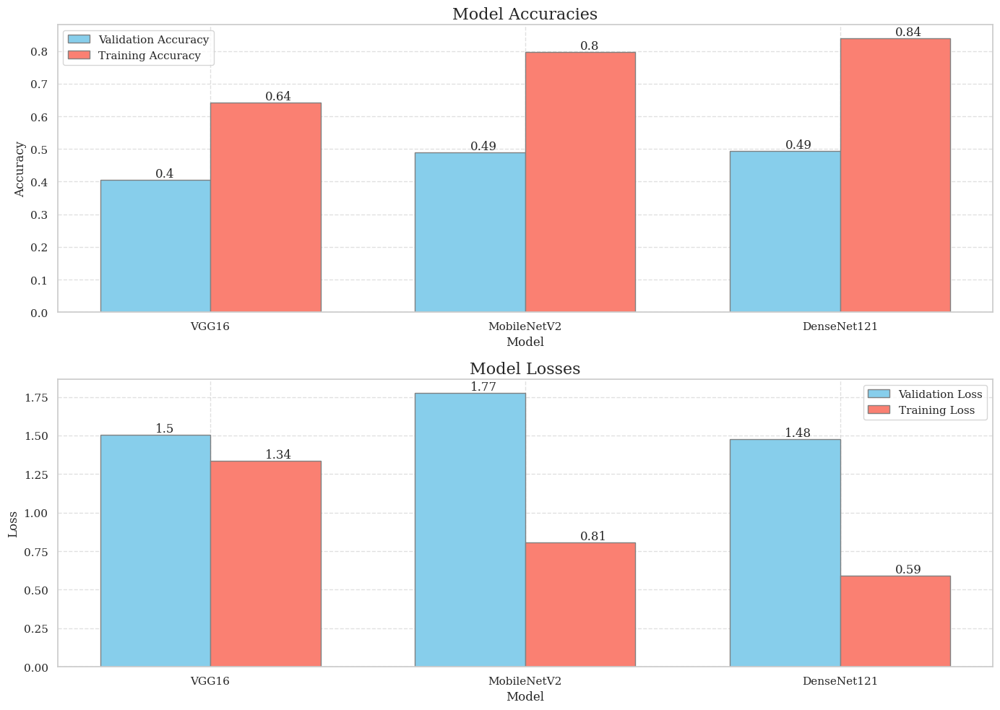

# Brain Tumor Classification

>  Disclaimer: The models used in this project are not fully optimized. They are currently in an experimental stage and will be re-trained and fine-tuned as soon as possible. The results and predictions provided by the current models should be interpreted with caution and are not intended for clinical or diagnostic use.

> Dataset used: **[Brain MRI Images](datasets/raw/)**  
> Notebooks: **[Models](https://nbviewer.org/github/trigeminal/brain-tumor-classification/blob/main/notebooks/model.ipynb)**

This project explores the effectiveness of various pre-trained Convolutional Neural Networks (CNNs) for classifying brain MRI images as containing a tumor or not. It leverages deep learning and transfer learning techniques to accurately identify the presence of brain tumors in MRI scans. The project includes:
1. **Notebook-based Model Training**: Training and evaluation of pre-trained models like **VGG16**, **MobileNetV2**, and **DenseNet121**.
2. **Flask API**: A Flask application for serving predictions using the trained DenseNet121 model.

## Models Used

1. **VGG16**: A popular CNN architecture known for its simplicity and effectiveness in image classification tasks.
   - Simple architecture that uses a stack of sixteen (16) convolutional layers followed by three (3) fully connected layers and a final softmax layer for classification. *More information can be found [here](https://keras.io/api/applications/vgg/)*.
2. **MobileNetV2**: A lightweight CNN architecture designed for mobile and edge devices with low computational resources.
    - It uses inverted residual blocks with linear bottlenecks and shortcut connections to build a compact and efficient model. *More information can be found [here](https://keras.io/api/applications/mobilenet/)*.
3. **DenseNet121**: A densely connected CNN architecture that connects each layer to every other layer in a feed-forward fashion.
    - It uses dense blocks with feature concatenation to improve feature reuse and reduce the number of parameters. *More information can be found [here](https://keras.io/api/applications/densenet/)*.

## Data Augmentation and Preprocessing

The project uses `ImageDataGenerator` for data augmentation with the following parameters:

- `rescale`: Rescale pixel values to the range [0, 1]
- `rotation_range`: Degree range for random rotations
- `width_shift_range`: Fraction of total width for horizontal random shift
- `height_shift_range`: Fraction of total height for vertical random shift
- `shear_range`: Shear intensity (shear angle in counter-clockwise direction in degrees)
- `zoom_range`: Range for random zoom
- `brightness_range`: Range for random brightness
- `horizontal_flip`: Randomly flip inputs horizontally
- `vertical_flip`: Randomly flip inputs vertically
- `fill_mode`: Points outside the boundaries of the input are filled according to the given mode

## Training and Evaluation

The models are trained using the training dataset and evaluated on the testing dataset. The training process includes early stopping and learning rate reduction on plateau callbacks.

## Results

The performance of each model is evaluated based on accuracy and loss metrics for both training and validation datasets. The results are visualized using matplotlib plots.



---

# Flask API

The Flask API provides a modularized and scalable way to serve predictions using the trained DenseNet121 model. It allows users to upload an MRI image and receive a prediction in JSON format.

To start the Flask API, run the following command:

```bash
python main.py
```

The API will be available at `http://localhost:5000`.

## API Endpoints

- **POST** `/predict`: Accepts an image file and returns the predicted class, confidence, and confidence percentage.

**Request Example**:

```bash
curl -X POST -F "file=@path_to_image.jpg" http://localhost:5000/predict
```

**Response Example**:

```json
{
    "confidence": 0.45110172033309937,
    "confidence_percentage": "45.11%",
    "predicted_class": "meningioma_tumor",
    "predicted_class_index": 1
}
```

## License

This project is licensed under the Apache License, Version 2.0 - see the [LICENSE](LICENSE) file for details.

<div align="center">
    
###### To God be the glory.
</div>